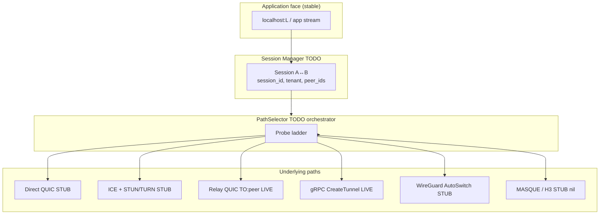
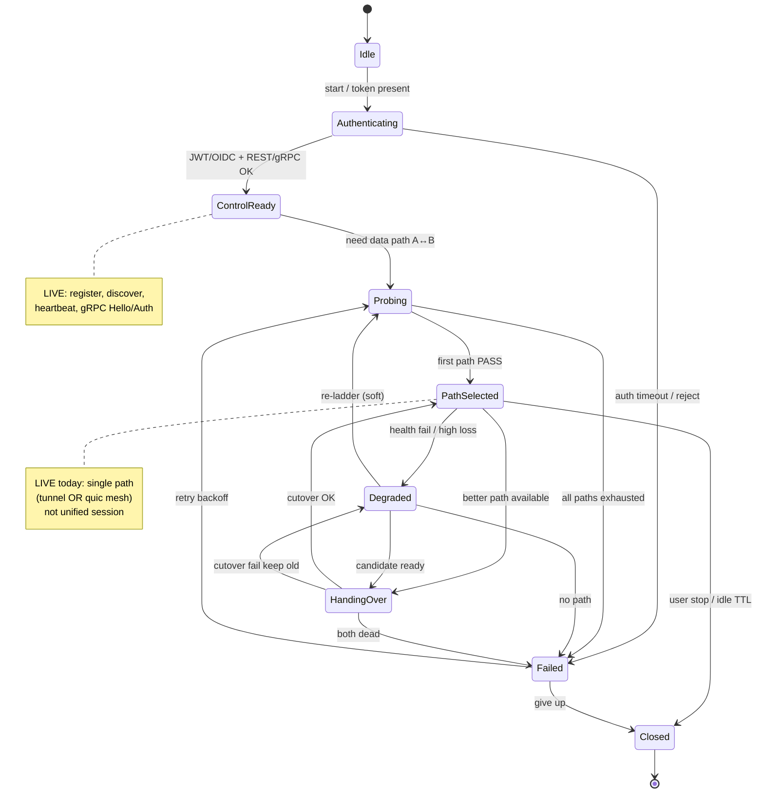
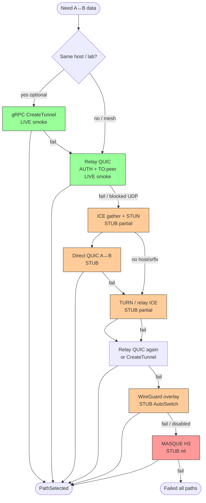
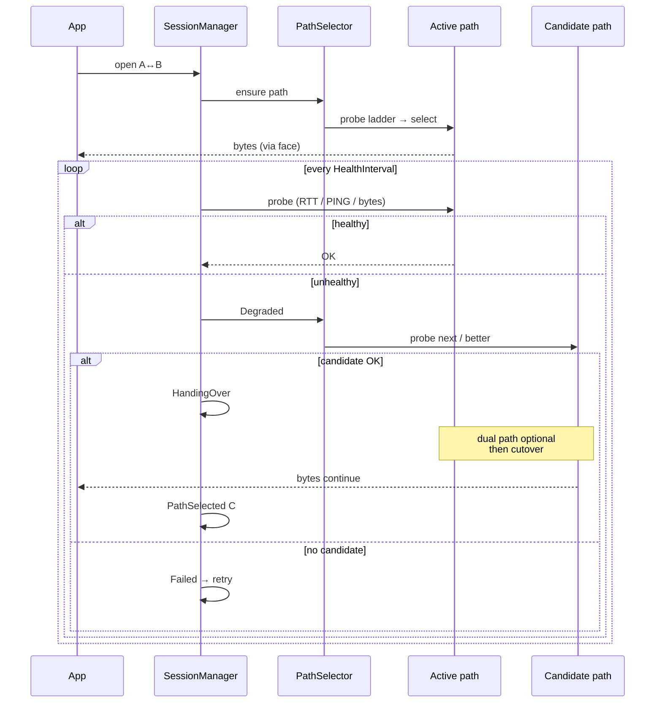

# Path selection state machine (A ↔ B)

**Status:** design target — **Phase A–B implemented** (`pkg/pathselect` library + `RelayQUICPath`/`GRPCTunnelPath` adapters); CLI wiring + chaos smokes Phase C  
**Date:** 2026-07-09  
**Documented:** 2026-07-09  
**Index:** [plans/README.md](./README.md)  
**Execution plan:** [GAP_CLOSURE_AND_IMPROVEMENTS.md](./GAP_CLOSURE_AND_IMPROVEMENTS.md) (phases A–G)  
**Code:** `pkg/pathselect` — `Session` state machine, `LadderSelector`, `RelayQUICPath`, `GRPCTunnelPath`, `NewDefaultPaths` (33 unit tests green)

**Honesty rule:** boxes marked **LIVE** have local smoke evidence; **STUB** exist as packages/config; **TODO** need wiring/e2e.

Related: [STATUS.md](../STATUS.md), [CONTRACT_CLIENT_RELAY.md](../CONTRACT_CLIENT_RELAY.md), Architecture.md.

---

## 1. Goal

One **logical session** between peer A and peer B. The application always sees a stable face:

- **Tunnel mode:** `localhost:L` (bytes in/out)
- **Mesh mode:** peer stream / L3 overlay (future)

Underneath, the client tries paths in order until one works, then monitors and may **handover** without breaking the app face.

---

## 2. Big picture



---

## 3. Session state machine



### Suggested timers (defaults)

| Transition / guard | Timeout | Notes |
|--------------------|---------|--------|
| Authenticating | 10s | gRPC/REST |
| Per probe attempt | 3–8s | path-specific below |
| Full ladder once | ≤ 45s | align with `--smoke-wait` |
| Health interval | 5–10s | RTT + loss + reachability |
| Degraded → re-probe | 15s cooldown | avoid flapping |
| Handover cutover | 5s | dual-write / drain |
| Idle session TTL | config | close quiet tunnels |
| Retry after Failed | exp backoff 1s…30s | already used in CLI |

---

## 4. Probe ladder (data plane)

Order is **policy**, not hard-coded forever. Default for self-hosted relay-first:



**Legend:** green = LIVE smoke · amber = STUB/partial · red = unwired

### Per-path probe definition

| Path | How to prove UP | Fail criterion | Code today |
|------|-----------------|----------------|------------|
| gRPC tunnel | CreateTunnel + TCP echo bytes | RPC/dial/echo fail | `scripts/grpc-smoke`, CLI `tunnel --smoke` |
| Relay QUIC | AUTH_OK + PING or TO:peer | dial/auth/timeout | `quic-smoke`, `quic-mesh-smoke`, `p2p --smoke-data` |
| ICE/STUN | candidates + connectivity check | no usable pair | `pkg/ice` exists; not e2e ladder |
| Direct QUIC | peer-to-peer stream | NAT block | not productized |
| TURN | relay candidate works | allocate/permission fail | config + server ports; client path incomplete |
| WireGuard | interface up + ping peer VIP | connect fail | `AutoSwitchManager` if `wireguard.enabled` |
| MASQUE | H3 CONNECT success | n/a | `masqueClient = nil` |

---

## 5. Health + handover (runtime)



### What exists vs missing

| Mechanism | Today | Target |
|-----------|--------|--------|
| QUIC↔WG timer | UDP dial MASQUE :8443 every 10s | Session-level health on **active path** |
| PING/PONG | LIVE on relay QUIC | Keep as probe primitive |
| Handover manager | `nil` stub | Token + dual path drain |
| SLO / synthetic probes | `nil` | Feed PathSelector scores |
| App-facing stability | Tunnel local listen | Always bound to Session, not raw path |

---

## 6. Mapping to current CLI / smokes

```text
p2p --smoke           → ControlReady only (skipDataPlane)          LIVE
p2p --smoke-data      → ControlReady + Relay QUIC PING             LIVE
tunnel --smoke        → gRPC CreateTunnel path                     LIVE
quic-mesh-smoke       → Relay QUIC TO:peer A↔B                     LIVE
all-smoke.sh          → suite of the above                         LIVE

PathSelector ladder   → `LadderSelector` + adapters in `pkg/pathselect` (library only)  Phase B
block UDP 5553 chaos  → must fall to CreateTunnel                  TODO smoke (Phase C)
block gRPC chaos      → must fall to QUIC mesh                     TODO smoke (Phase C)
```

---

## 7. Minimal implementation slice (PR plan)

1. **`pkg/session` (or `pkg/pathselect`)**  
   - `Session` state enum + timers  
   - interface `Path { Probe(ctx); Open(); Close(); Health() }`

2. **Adapters (wrap existing code)** — **Phase B done**  
   - `GRPCTunnelPath` → CreateTunnel + local proxy (`grpc_tunnel_path.go`)  
   - `RelayQUICPath` → AUTH + TO/PING (`relay_quic_path.go`)  
   - (later) `ICEPath`, `WGPath`

3. **Ladder policy config**  
   ```yaml
   path_select:
     order: [relay_quic, grpc_tunnel, wireguard]
     probe_timeout: 5s
     health_interval: 10s
     handover: false  # phase 2
   ```

4. **CLI**  
   - `p2p --connect <peer>` uses Session+ladder  
   - keep `--smoke-data` as fixed-path probe

5. **Chaos smokes**  
   - `SMOKE_BLOCK=udp:5553` → expect tunnel  
   - `SMOKE_BLOCK=tcp:8444` → expect quic  

---

## 8. One-page “happy path” (target production)

```text
A and B boot
  → auth (OIDC/JWT)
  → REST register + heartbeat          [ControlReady]
  → PathSelector:
       try Relay QUIC mesh (prefer low latency mesh)
       else gRPC tunnel to service VIP
       else WG if enabled
  → PathSelected
  → health PING every 10s
  → if fail: HandingOver to next path
  → app still sees localhost:L or peer IP
```

**Today’s honest happy path (what you can run):**

```text
A,B: p2p --smoke-data / register
+ either:
    tunnel --smoke  (service reachability via relay TCP)
  or:
    quic-mesh-smoke (A↔B frames via relay QUIC)
```

No automatic “if X blocked use Y” between those yet.

---

## 9. Decision summary

| Question | Answer |
|----------|--------|
| Is architecture direction sound? | **Yes** — session + ladder + multipath |
| Is auto protocol switch done? | **No** — stubs + one weak QUIC↔WG probe |
| What to build next? | **Phase C: wire Selector to CLI + 2 chaos smokes** (adapters ready) |
| What not to build next? | More protocols before orchestration |
